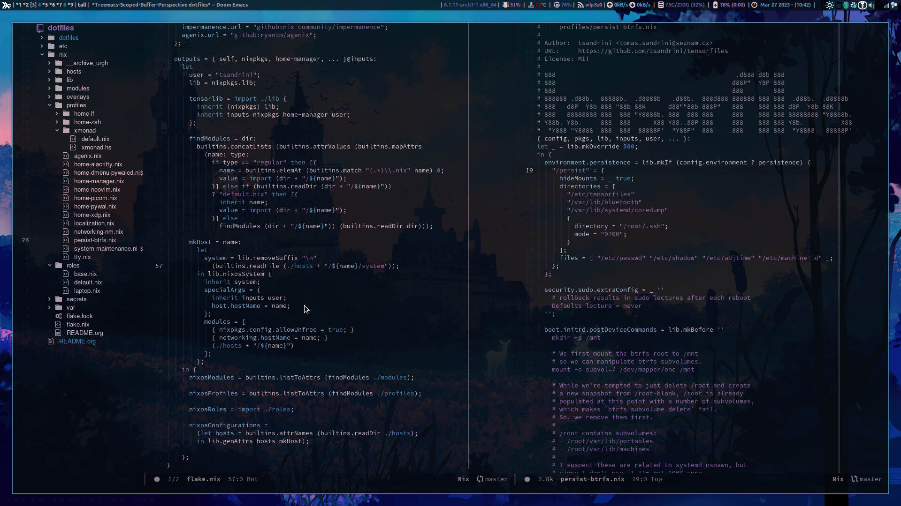

# tensorfiles

## Table of Contents

1. [About](1-about)
2. [Software](2-software)
   1. [Academics](21-academics)
   2. [Secrets](22-secrets)
3. [Installation](3-installation)
4. [(rough) Roadmap](4-rough-roadmap)
5. [Troubleshooting](5-troubleshooting)
   1. [`Write error: disk full;` during `nixos-install`](write-error-disk-full-during-nixos-install)
6. [Impurities](6-impurities)
7. [References](7-references)

## 1. About

**tensorfiles** represent a set of _fully covariant_, that is invariant to the
chosen coordinate system (**they work on every machine**), fundamental
laws of computing (**how to build my fancy flashy terminals**)




For more info refer to the [documentation](https://tsandrini.github.io/tensorfiles/).
The project is also hosted at on [FlakeHub](https://flakehub.com/flake/tsandrini/tensorfiles/).

## 2. Software

I use the following software

TODO rewrite into a list, tables are super unreadable in code

### 2.1. Academics

TODO comment more?

1. [org-roam](https://www.orgroam.com/): This is the heart of everything that I
   do, TODOs, daily journals, scratchpads, notetaking and personal research wiki.
   The internal wiki is interlinked with zotero entries as well as anki cards.
   - TODOs: [org-agenda](https://orgmode.org/manual/Agenda-Views.html)
   - visualization: [org-roam-ui](https://github.com/org-roam/org-roam-ui)
   - anki connection: [org-anki-editor](https://github.com/louietan/anki-editor)
     
2. [zotero](https://www.zotero.org/): This is my backend for all of my
   bibliography as well as the individual `.pdf` files. As of now I keep them up
   to date between machines using [syncthing](https://syncthing.net/), but
   I&rsquo;ll probably set up a personal cloud when I&rsquo;ll have spare time.
3. [anki](https://apps.ankiweb.net/): Since I have the memory of worm I try to
   keep my long-term memory of different subjects fresh using flashcards. I sync
   the cards using ankis official cloud.

### 2.2. Secrets

For my day to day passwords I use a locally synced
[keepassxc](https://keepassxc.org/) encrypted database and for the NixOS based
secrets I use [agenix](https://github.com/ryantm/agenix). I also try to avoid
using any globally available pubkeys and rather tend to use machine specific
ones instead (for obvious reasons).

_Note_: plz no pwn xd, if you see any vulnerabilities please DM me instead,
thanks <3.

## 3. Installation

TODO

## 4. (rough) Roadmap

- [-] \***\*organization\*\***
  - [ ] finish doc
  - [x] decouple <nix/roles/base.nix>
  - [x] decouple <nix/flake.nix>
  - [x] move nix/ to be the project root
- [-] \***\*implementation\*\***
  - [ ] syncthing (local version)
  - [ ] syncthing (remote)
  - [ ] searx (remote)
  - [x] newsboat
  - [ ] thunderbird
  - [ ] zotero
  - [ ] anki
  - [ ] emacs
  - [ ] discord
  - [ ] misc? vlc? libre?
- [ ] \***\*machines\*\***
  - [ ] jetbundle
  - [ ] pi
  - [ ] server

## 5. Troubleshooting

### `Write error: disk full;` during `nixos-install`

If you get any error of this kind during the installation of this flake
you have most likely run out of `$TMPDIR` space. This is usually due
to `$TMPDIR` being set up as a RAM based tmpfs and thus not having enough
RAM for nix store cache during installation.

The most clean & general solution to this would be to create a minimal
based installation and then run a `nixos-rebuild` (and I still might do that)
but that kind of defeats the purpose of what I am aiming for which would be
to run `nixos-install`, a single command, and end up with a fully prepared
system.

Considering that a quick workaround is to navigate `$TMPDIR` to a different
folder (this might slow the installation process if you redirect it to a
spinning disk tmp filesystem, however, assuming you have a decent bandwidth
is&rsquo;s still just by minutes)

```bash
mkdir -p /mnt/tmp
USER=$USER TMPDIR="/mnt/tmp" nixos-install --root /mnt --flake .#$HOST
```

A different solution in case you have more spare RAM would be to remount
tmpfs, for example

```bash
mount -o remount,size=15G /tmp
```

## 6. Impurities

- some of the packages in [NUR](https://github.com/nix-community/NUR) require
  running `--impure`
- devenv requires `--impure` flag for commands

## 7. References

The whole nix ecosystem is in its foundations a revolutionary piece of
software and once you get the hang of it you feel like you&rsquo;ve really
conquered the art of computer wizardry, however, it&rsquo;s so different from
everything that is the current status quo of compsci and thus needs
appropriate extensive documentation/tutorials/etc&#x2026; which is, however,
currently not the case.

Due to this exact reason I&rsquo;m leaving here a list of resources/flakes that
helped me to (somewhat) learn the ways of nix (TODO: maybe write more?
manual.org?)

- [Nix Pills: obligatory pills](https://nixos.org/guides/nix-pills/)
- [NixOS search: this should be your homepage really](https://search.nixos.org/options)
- [Home-Manager opts search: the same search but for home-manager, secondary
  homepage tbh](https://mipmip.github.io/home-manager-option-search/)
- [hlissner/dotfiles: great resource for learning how to appropriately modularize code](https://github.com/hlissner/dotfiles)
- [notusknot/dotfiles-nix: a more straightforward config but with all the needed
  parts, great introduction to flakes, home-manager](https://github.com/notusknot/dotfiles-nix)
- [Nix Cookbook: custom scripts, package wrapper scripts](https://nixos.wiki/wiki/Nix_Cookbook)
- [balsoft/nixos-config: more modularized but not overly complicated config](https://github.com/balsoft/nixos-config)
- [A really nice blogpost/tutorial on encrypted nixos opt-in system using btrfs](https://mt-caret.github.io/blog/posts/2020-06-29-optin-state.html)
- [Github code search: thanks to how the nix lang works the code search should be of a huge help, included an example](https://github.com/search?q=pkgs.writeShellScriptBin+language%3ANix&type=code&l=Nix)
